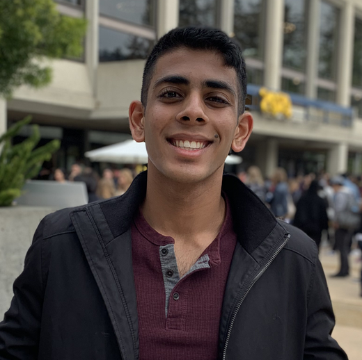

## About Me

I am a rising senior studying computer science at the University of California, Berkeley. My research interests lie in the intersection of deep learning and robotics, and I am fascinated with the idea of creating assistive robots for the world. I am a researcher at the Berkeley Artificial Intelligence Research Lab under Professor John Canny, working closely with his PhD student, Daniel Seita. I am currently pursuing opportunities in CS PhD programs to continue my research interests.

## Current Projects
### Teaching Project with Offline Batch Reinforcement Learning
Currently, the primary project that I am working on is regarding a training a student agent to learn from a curriculum of teachers using Offline Batch Reinforcement Learning. Students learn from demonstration data taken from teachers, and we are interested in seeing what aspects of the teacher make learning more optimal for certain students. We hope to answer some interesting questions, like the influence of state space similarity between teacher and student on training time, and the possibility of using intrinsic reward to encourage students to move to low-noise/low-uncertainty states.

## Teaching
### EECS 70
I am currently a Teaching Assistant for EECS70: Discrete Math and Probability Theory at UC Berkeley. I enjoy leading discussions, interacting with students regarding connections to research, and helping with course content creation! I enjoy using a joke of the day to start off my sections, and strive to maintain a productive and relaxing learning environment for students!

